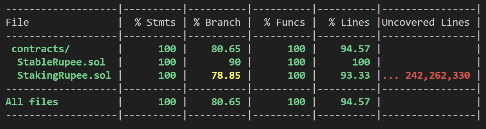
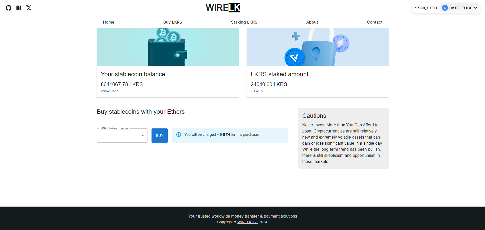

# Projet WIRELK : Stablecoin for Sri Lankan Rupee (LKRS)

## Resources externes :

- Lien de l'application déployé : https://wirelk.vercel.app/ 

- Lien vidéo de démo : https://we.tl/t-SV8Y9ue4eV 

- Liens SmartContracts déployés et validés sur testnet : 
	- StableRupee.sol : https://sepolia.etherscan.io/token/0xe23B23f2D5177699D5cEeD8FBd60d5BE7F4b27E0
	- StakingRupee.sol : https://sepolia.etherscan.io/address/0xb649ae3caea1e720fca6818dff46c97cca4d91e2 

## Détails

Mise en place d’un écosystème permettant de faire des micro-paiements B2C et transfert d’argent C2C dans les pays émergents (Sri Lanka).
Un Stablecoin adossé à la roupie Sri Lankaise peut nous permettre de répondre aux problématiques comme le coût élevé et la rapidité de transfert.

### Contract
Contract n°1 : StableRupee.sol est un ERC20 qui permets de gérer le stablecoin LKRS

- Toutes les fonctionnalités de ERC20
- Mint et Burn possible
- Achat du token avec l’envoi de Ethers
- Appel à Chainlink pour connaître le prix du ETH/USD
- Permet de récupérer le prix en USD d’un Ether
- Permet de récupérer le prix en LKR d’un USD
- Une méthode qui permets de transférer les ETH du contrat vers l’address du Owner

Contract n°2 : StakingRupee.sol permets de gérer le staking du LKRS

- Le constructeur prends l’address du Stablecoin (LKRS) en paramètre
- Setup de la durée, nombre de token disponible pour les récompenses
- La possibilité de staking le token LKRS
- La possibilité de staking les Ethers
- La possibilité de récupérer les LKRS 
- La possibilité de récupérer les Ethers
- Remonter le nombre de token LKRS staké pour une address (sender)
- Remonter le nombre de Ethers staké pour une address (sender)
- Remonter le nombre de token gagné en récompense
- La possibilité de récupérer les gains du staking en LKRS

Sécurité : Analysé avec Slither et corrections des failles possibles

Documentation : Mise en place des Natspec

### Testing

### Front
Voici la liste de la stack utilisée pour la réalisation du projet
- ReactJs
- NextJs
- MaterialUI
- Wagmi + Viem
- RainbowKit

### DApp Screen 
